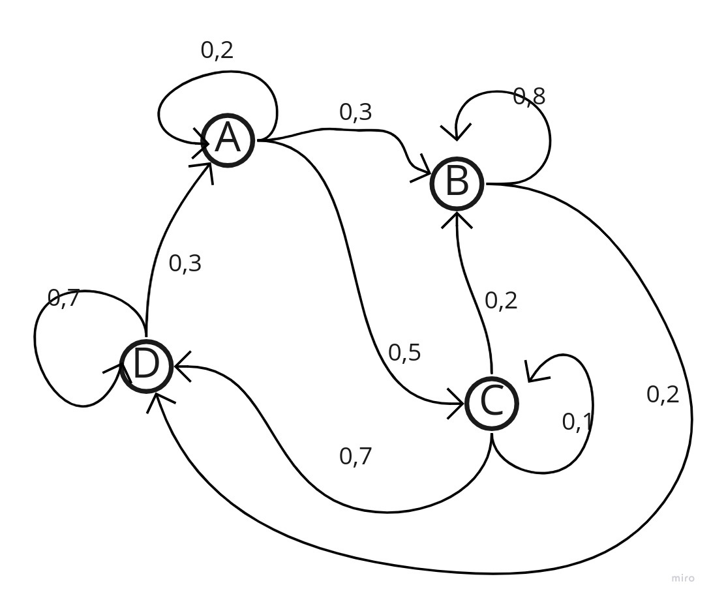

# Cadeias de Markov

## Definição: 
Considere o processo estocástico {$X_{n},n\in N$}. Nós dizemos que este processo é uma cadeia de Markov se:  
$P(X_{n+1}=j|X_{0}=i_{0},X_{1}=i_{1},...,X_{n}=i)=P(X_{n+1}=j|X_{n}=i)$  
Para todos estados $i,j,i_{0},...,i_{n-1}$  
 
$$P = \begin{bmatrix} & A & B & C & D\\
A & 0,2& 0,3 & 0,5 & 0\\
B & 0 & 0,8 & 0 & 0,2\\
C & 0 & 0,2 & 0,1 & 0,7\\
D & 0,3 & 0 & 0 & 0,7\\
\end{bmatrix}$$  
   

