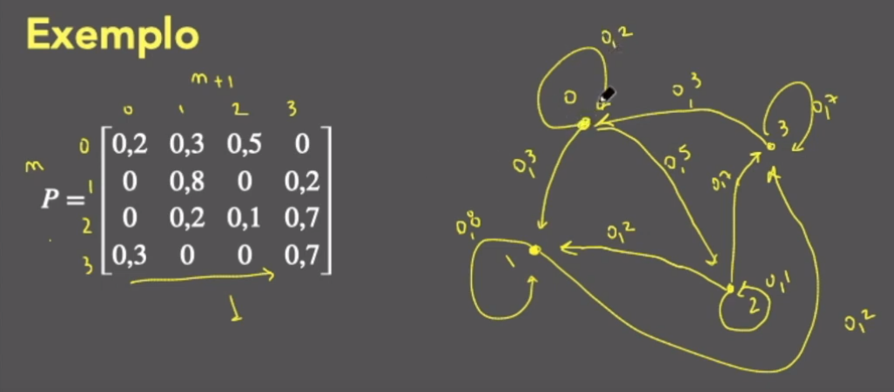

# Cadeias de Markov
## Video-Aula  
Cadeia de Markov - Aula 1  
link: https://www.youtube.com/watch?v=k6FAZJGTZJo&list=PLSc7xcwCGNh0jSylDm0QrDJaFTC3vAbvc&index=2

## Definição: 
Considere o processo estocástico {$X_{n},n\in N$}. Nós dizemos que este processo é uma cadeia de Markov se:  
$P(X_{n+1}=j|X_{0}=i_{0},X_{1}=i_{1},...,X_{n}=i)=P(X_{n+1}=j|X_{n}=i)$  
Para todos estados $i,j,i_{0},...,i_{n-1}$  
 
  
 
