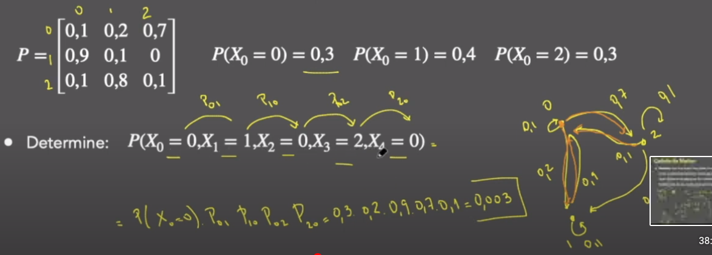
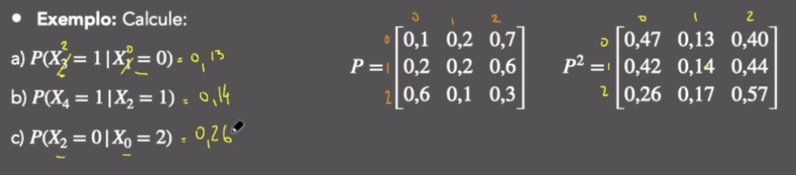
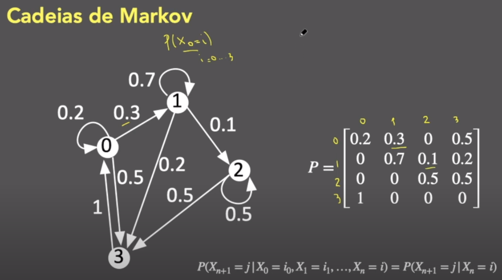
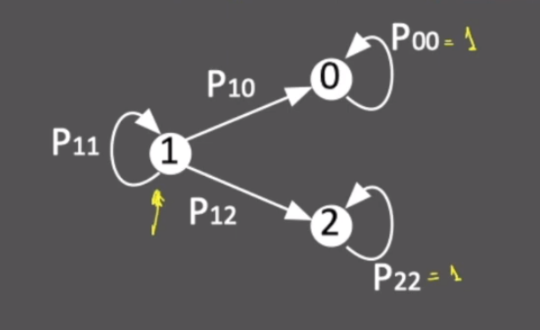

# Cadeias de Markov
## Video-Aula  
Cadeia de Markov - Aula 1  
link: https://www.youtube.com/watch?v=k6FAZJGTZJo&list=PLSc7xcwCGNh0jSylDm0QrDJaFTC3vAbvc&index=2

## Definição: 
Considere o processo estocástico {$X_{n},n\in N$}. Nós dizemos que este processo é uma cadeia de Markov se:  
$P(X_{n+1}=j|X_{0}=i_{0},X_{1}=i_{1},...,X_{n}=i)=P(X_{n+1}=j|X_{n}=i)$  
Para todos estados $i,j,i_{0},...,i_{n-1}$  
 
  
 
Seja P uma matriz quadrada cusjas entradas $P_{ij}$ são definidas para todos os estados i e j. Então, P é chamada matrix Markoviana (ou matriz de probabilidade de transição) se:  
* Para todo $i\in S, P_{ij}\ge0$, onde S é o conjunto de estados. 
* $\sum_{i\in j}P_{ij}=1,\forall i \in S$  
Um processo Markoviano é totalmente definido pela sua matriz de probablidades de transição e a distribuição de probabilidade de $X_{0}$  
### Exemplo:  
Uma cadeia de Markov $X_{0},X_{1},...,X_{n}$ nos estados 0, 1, 2 tem matriz de probabilidade de transição e distribuição de probabilidade inicial:  
  
$P(X_{0}=0)=0,3  P(X_{0}=1)=0,4 P(X_{0}=2)=0,3$ -> Probabilidade de começar nesses estados  
$P(X_{0}=0).P_{01}.P_{10}.P_{02}.P_{20}=0,3.0,2.0,9.0,7.0,1=0,003$  
 
### Exemplo  
Uma cadeia de Markov $X_{0},X_{1},...,X{n}$ nos estados 0, 1, 2 tem matriz de probabilidade de transição e distribuição de probabilidade inicial:  
**Determine**: $P(X_{1}=1,X_{2}=0|X_{0}=0)$ "Determine a probabilidade de ir da posição 1 para posição 0 dado que inicia na posição 0"  
**Resposta:** $P(X_{1}=1,X_{2}=0|X_{0}=0) = P_{01}.P_{10} = 0,2.0,9=0,18$  
 
### Exemplo  
Uma cadeia de Markov $X_{0},X_{1},...,X{n}$ nos estados 0, 1, 2 tem matriz de probabilidade de transição e distribuição de probabilidade inicial:  
**Determine**: $P(X_{2}=2,X_{3}=0|X_{1}=0)$ "Determine a probabilidade de ir da posição 2 para posição 3 dado que inicia na posição 0 - $X_{1}$ não é a posição 1 é o tempo 1, '=0' que diz que qual é a posição"   
**Resposta:** $P(X_{2}=2,X_{3}=0|X_{1}=0) = P_{02}.P_{20}=0,7.0,1=0,07$  
 
## Teorema: (Equações de Chapman-Kolmogorv)  
A probabilidade de transição no n-ésimo passo para uma cadeia de Markov satisfaz:  
$P_{ij}^{n}=P(X_{m+n}=j|X_{m}=i)=\sum_{k=0}^{\infty}P_{ik}P_{kj}^{n-1}$  
onde definimos $P_{ij}^{0}= \delta = \begin{matrix} 1 & i=j \\ 0 & i \neq j \end{matrix}$  
 
### Exemplo
  
 
## Video-Aula  
Cadeia de Markov - Aula 2  
link: https://www.youtube.com/watch?v=0ymZ2Iv_9q8&list=PLSc7xcwCGNh0jSylDm0QrDJaFTC3vAbvc&index=3  
 
  

## Estados da cadeia 
* Transientes 
* Recorrentes
* Absorventes

#### Perguntas que estamos inressados:
* Probabilidade de absorção:
    * Inciando em um vértice i, qual é a probabilidade de visitar um outro vértice j?
* Tempo média para absorção
    * Inciando em um vértice i, quanto passos, em média, são necessário para visitar o vértice j pela primeira vez?
* Número médio de visitas:
    * Inciando em um vértice i, quantas vissitas um vértice k vai receber antes de chegar em outro vérice j?

  
* **Tempo médio até a absorção:**
$T=min\{n \ge 0;X_{n}=0$ ou $X_{n}=2\}$
* **Probabilidade de absorção:**$P(X_{T}=0|X_{0}=1)=u$
* **Tempo médio até a absorção:** $E[T|X_{0}=1]=v$

### Análise do primeiro passo
$P(X_{T}=0|X_{0}=1)=u=?$

